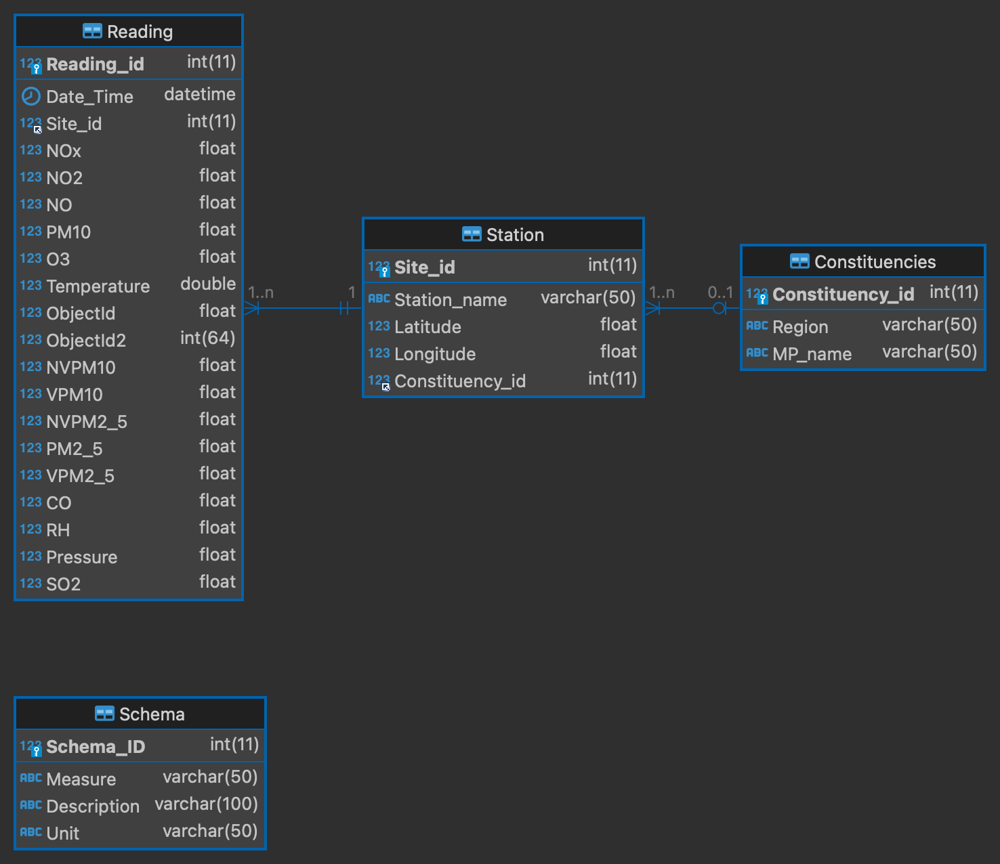
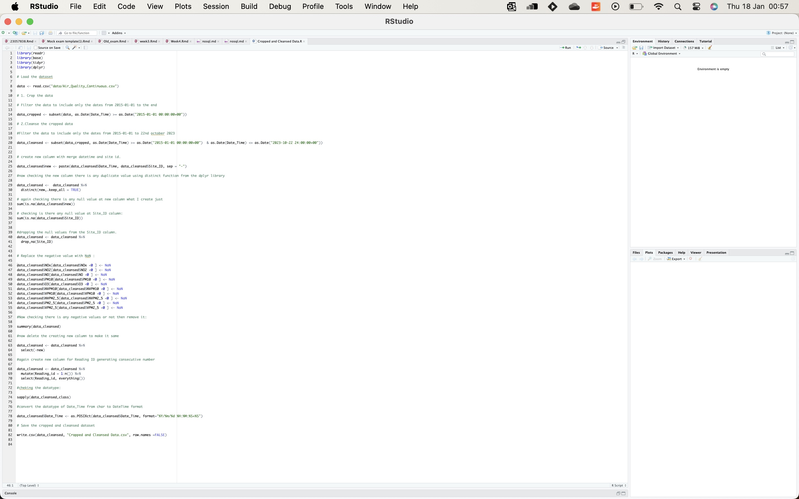
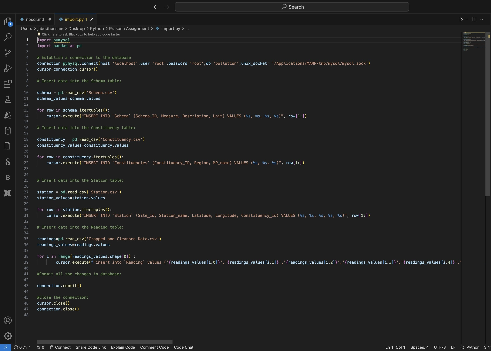

# Reflective Report

I collected and analyzed data on air pollution levels from 19 monitoring stations in and around Bristol, covering the period from 1993 to 22 October 2023.

## Task1:
 
1. I learned how to create an ER model using MySQL Workbench and DBeaver, and how to apply the normalization rules to avoid data redundancy and inconsistency.
2. I learned how to cope with various challenges and errors during the data modeling process, such as system compatibility, data type conversion, and dependency identification.

## Task2:
1. I learned how to forward engineer my ER model to a MySQL database using DBeaver, and how to generate the SQL file for the table and attribute definitions.
2. I learned how to use the features of DBeaver to automate the data modeling process and avoid errors.

## Task3:
1. I learned how to crop and cleanse the data using Python and R, and how to filter, merge, and validate the data according to the given criteria.
2. I learned how to check for and handle missing values, outliers, and errors in the data, and how to decide whether to delete or replace them with appropriate values.
3. I learned how to use various resources such as search engines, python websites, and blog posts to find solutions and guidance for the data cleansing task.
4. I learned how to overcome the challenges and difficulties I faced during the data cleansing process, such as understanding the data, resolving the data type error, and checking for duplicates.

## Task4:
1. I learned how to import the cropped and cleansed dataset into the MySQL database tables using PhpMyAdmin’s “import CSV” feature and I did it using DBeaver also and how to deal with the data truncated error by changing the data type of the date_time column.
2. I learned how to write Python code to automate the data mapping task, and how to connect to the MySQL database using Python libraries and modules.
3. I learned how to populate the reading data using Python code, and how to select and import the data from the CSV files into the database tables.

## Task5:
1. I learned how to write and run SQL queries to find specific information from the data, such as the highest recorded value of nitrogen oxide (NOx), the mean values of PM2.5 and VPM2.5 by each station, and the extension of the previous query to show these values for all stations for all the data.
2. I learned how to use the join function to combine data from different tables and to call the station name instead of the site_id.
3. I learned how to use Linkend Learning as a resource to understand the basic query code and syntax.
4. I learned how to create a Function and Procedure in PHPmyadmin.
