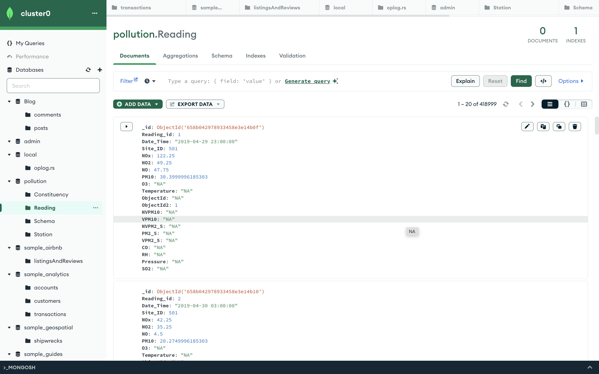
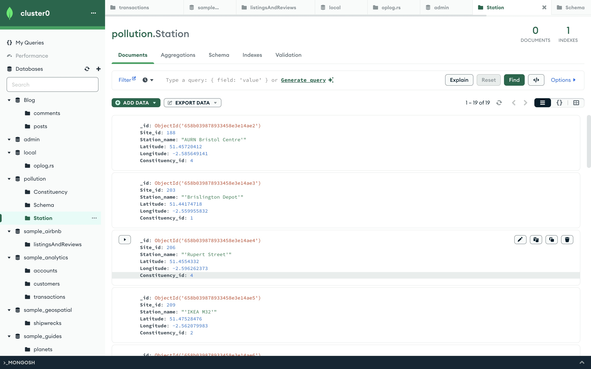
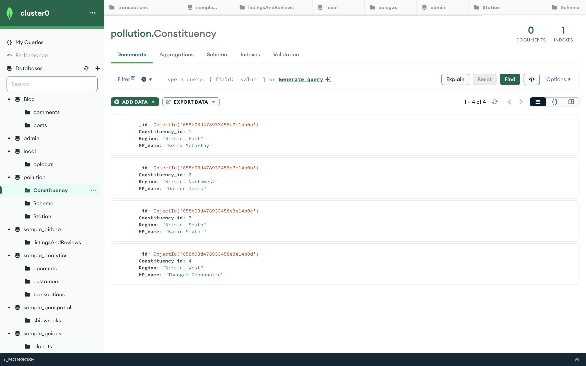
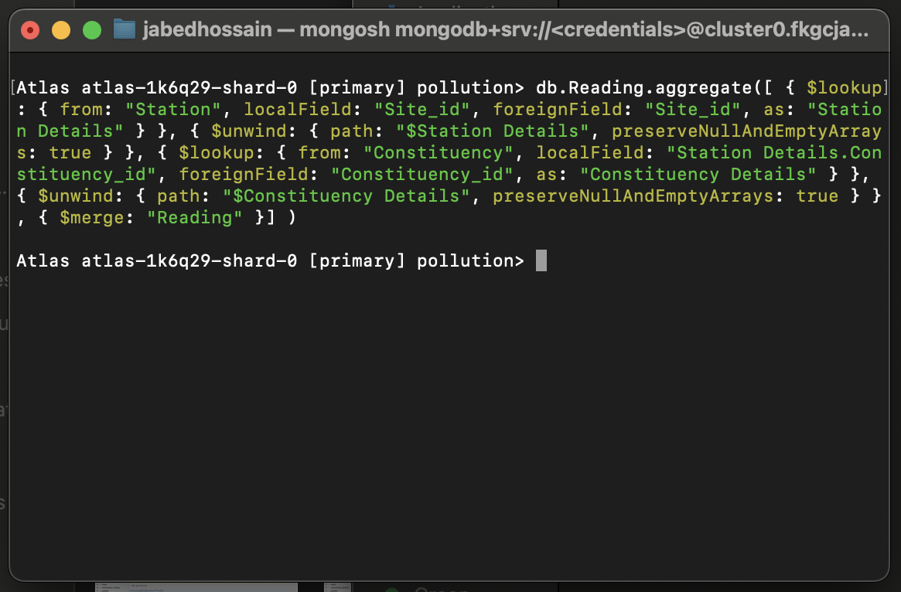
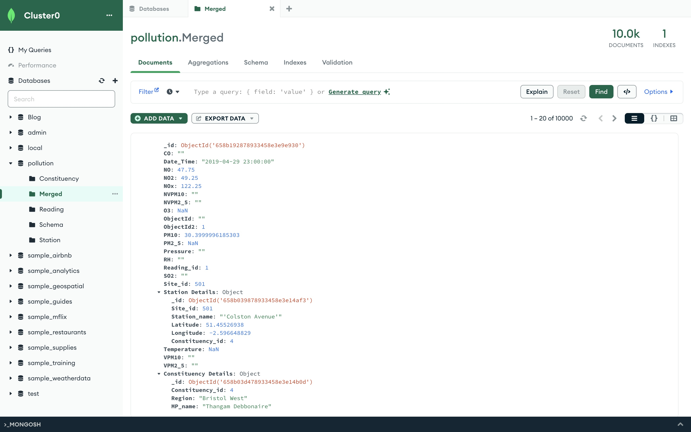
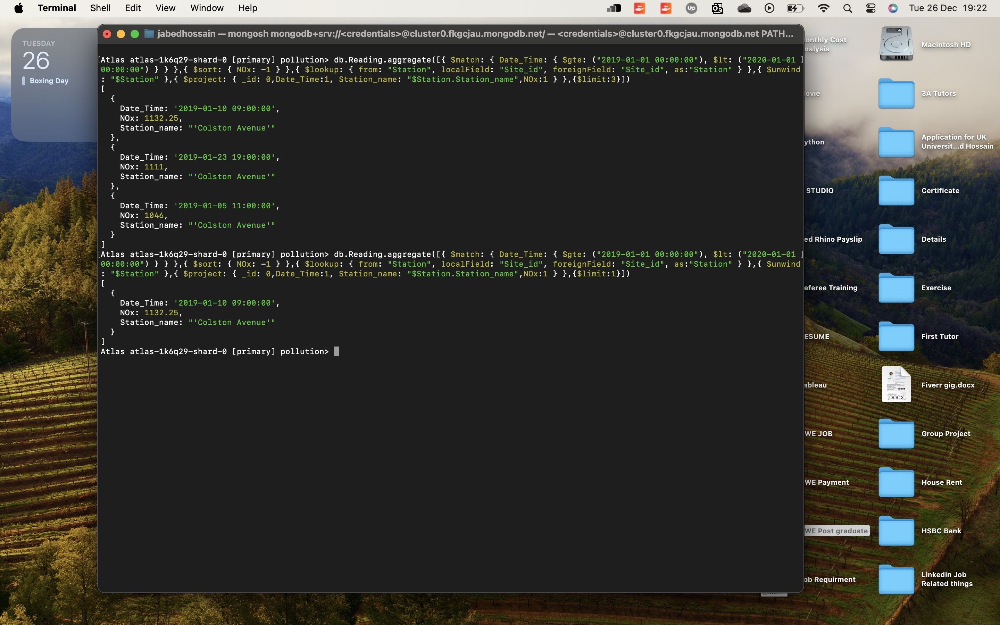
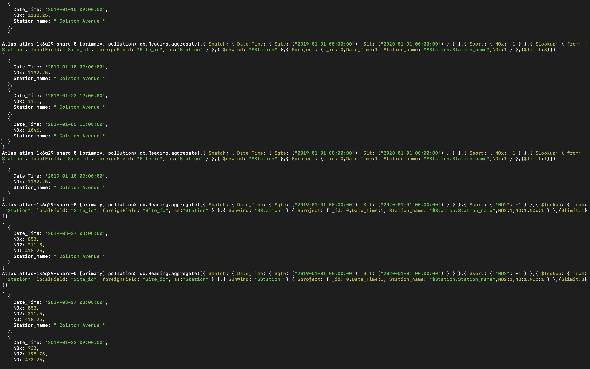

# Research and Implementation of NoSQL Database for Pollution Data
### Introduction
This report presents the research and prototype implementation of a NoSQL database using MongoDB for managing the “Air pollution” data in Bristol. The database named ‘pollution’ consists of five collections: Schema, Station, Constituency, Reading, Merged. The use of a NoSQL database offers several advantages over traditional relational databases, particularly in handling large volumes of structured, semi-structured, and unstructured data.

I chose a NoSQL database for my project because it offered me several advantages over a SQL database. First, a NoSQL database has a flexible data model, which means I can store different types of data without having to follow a rigid schema. This makes it easier to adapt to changing requirements and data formats. Second, a NoSQL database can scale horizontally, which means I can add more servers to handle increased workloads. This makes it more cost-effective and reliable than a SQL database, which can only scale vertically by upgrading to a larger server. Third, a NoSQL database has fast queries, which means I can access and process my data quickly and efficiently. This is especially important for applications that deal with large amounts of data or complex operations.

When I had to choose a NoSQL database for my project, I decided to go with MongoDB for several reasons. First, MongoDB is the most widely used NoSQL database, which means it has a large and active community of users and developers who can provide support and feedback. Secondly, MongoDB's BSON data format allows me to store data in flexible documents, where I can have different sets of fields for different objects in the same collection. This gives me more freedom and efficiency in managing my data. Thirdly, MongoDB has a powerful querying and analytics pipeline, which enables me to perform complex operations and transformations on my data. Finally, MongoDB is a full cloud-based data platform for developers, which means I can access and work with my data from anywhere, using any language I prefer, whether it is Python, Java, or something else.

### Prototype Implementation
The prototype was implemented using MongoDB. Here are some factors why this is a popular NoSQL database. 

A document is a basic unit of data in MongoDB and Collection is a grouping of documents. So, a document in a collection does not have to be exactly the same data-type format as the platform has a flexibility in the schema model. Data in MongoDB is displayed in JSON format and stored in database as BSON format. BSON is short of binary JSON. But it also adds supports data-typed which is unavailable in JSON.

A sample of 10,000 records from the ‘Cropped and Cleansed.csv’ file was uploaded to the ‘Reading’ collection.


And also upload data to Staion collection,Constituency collection what i created in my MongoDB database.





 Each record in the ‘Reading’ collection contains a ‘Site_id’ field, which is used to link to the corresponding Station_name in the ‘Station’ collection for query. But in NoSQL database the important thing that it does not have any relational database. So for making this I just created codes in the terminal. The first thing I did was call `$aggregate()` then to select the site_id from the Reading collection and then use `$lookup()` function to select Station collection and select the field Site_id and checked every field which is matched with the Reading Site_id. I only took the Station Details and merged it to the new collection name Merged. In the Station Details there is Constituency_id so I took the Constituency details from the Constituency collection and show the only matched constituency_id and merged it on to Merged collection. Here is the code I made for this:


 
In one line every information I need is available which is the most important thing for NoSQL database:


 
Now, I can say that this is the perfect no SQL database like every detail we need in one line. 
#### Example Query

An example query was written to filter the maximum NOx value for the year 2019 from the ‘Reading’ collection. The query uses the `$lookup()` function to join the data from the ‘Station’ collection based on the ‘Site_id’, replacing the ‘Site_id’ with the actual ‘Station_name’. The result of the query includes the ‘Station_name’, ‘Data_Time’, and ‘NOx’ values by using `$projection()` function in the query. I did `$aggregate()` operation to get the data without altering the actual source data.

Here is my query code and output:

```db.Reading.aggregate([{ $match: { Date_Time: { $gte: ("2019-01-01 00:00:00"), $lt: ("2020-01-01 00:00:00") } } },{ $sort: { NOx: -1 } },{ $lookup: { from: "Station", localField: "Site_id", foreignField: "Site_id", as:"Station" } },{ $unwind: "$Station" },{ $project: { _id: 0,Date_Time:1, Station_name: "$Station.Station_name",NOx:1 } },{$limit:1}])```


 

Here, I am using `$limit()` to limit the result I want to show. Using `$sort()` takes the Maximum value of NOx and using -1 makes it in descending order. The most important and complex function here is `$lookup()`. Using this function I take the value of Station_name from the Station collection by using our Site_id from the Reading collection. With the Station collection Site_id being the primary key it will extract the corresponding Station_name and show it in the result.
By changing the value of `$sort()` function or `$projection()` or `$limit()` we can do more kind of query example.

#### Another example:
Here I took the maximum value of NO2.

```db.Reading.aggregate([{ $match: { Date_Time: { $gte: ("2019-01-01 00:00:00"), $lt: ("2020-01-01 00:00:00") } } },{ $sort: { "NO2": -1 } },{ $lookup: { from: "Station", localField: "Site_id", foreignField: "Site_id", as:"Station" } },{ $unwind: "$Station" },{ $project: { _id: 0,Date_Time:1, Station_name: "$Station.Station_name",NO2:1 } },{$limit:1}])```

Here, is my output:


 

Also I can add more value in the projection() like : 
`{$project:{_id:0,Date_Time:1,Station_name:"$Station.Station_name",NO2:1,NOX:1,NO:1 } `
Here we can see NOx value and NO value. We can also change our `$limit()` value to show more value.
### Discussion
At first for me everything in MongoDB is new, I then decided to take a course from LinkedIn Learning and found out that MongoDB officially offer a full course. It took me two days to complete the full course and I was able to apply the things I learned from the course. I even got certificate in doing so. It feels good knowing everything form the basic and now its clear that I am familiar with every function and syntax. 

The use of a NoSQL database like MongoDB offers several advantages over traditional relational databases. MongoDB stores data in a flexible, JSON-like format that can vary in structure. This is particularly useful for the ‘Reading’ collection, which may contain a large number of distinct fields.

The use of the  `$lookup()` function in MongoDB queries allows a form of joined operation, similar to those in relational databases. However, the flexibility of MongoDB’s data model allows for more efficient querying and data retrieval.

In conclusion, the use of MongoDB for the ‘pollution’ database demonstrates the effectiveness of NoSQL databases in handling large volumes of diverse data. The prototype implementation and example query highlight the flexibility and power of MongoDB’s data model and query language.


### Referencing

1. MongoDB Documentation. Available from: https://www.mongodb.com/docs/manual/reference/operator/aggregation/lookup/ [Accessed 26 December 2023].


